# iOS-Experiments Contents

Table of Contents of [iOS-Experiments](https://github.com/shu223/iOS-Experiments) repository.

## How to access to `iOS-Experiments`?

Here are some way to get access to the private repo:

- Become a sponsor (`premium` or higher): https://github.com/sponsors/shu223
- Let me know that. [Here](https://github.com/shu223) is my email address.

## Table of Contents

### Google Cloud Speech API sample

- A sample of Google Cloud Speech-to-Text API
- Modified `ios-docs-samples/speech/Objective-C/Speech-gRPC-Nonstreaming` in the official repository to recognize the audio of audio files.
  - 公式リポジトリの`ios-docs-samples/speech/Objective-C/Speech-gRPC-Nonstreaming`を改変し、オーディオファイルの音声を認識するようにしたもの
- You should replace `API_KEY` when you use it.
  - 利用にあたっては`API_KEY`を差し替えること

### vottcsv2createml

- Tool to convert annotation files as VoTT CSV format to Create ML JSON format.
  - VoTT CSVフォーマットのアノテーションファイルをCreate MLのObject Detection用のJSONフォーマットに変換するツール
- I made this for myself, so it's not very kind and incomplete.
  - 自分用につくったのでいろいろ不親切＆不完全

### yolo2createml

- Tool to convert annotation files as YOLO format (.txt) in YOLO format to Create ML JSON format.
  - YOLOフォーマットのアノテーションファイル（.txt）をCreate MLのObject Detection用のJSONフォーマットに変換するツール
- I made this for myself, so it's not very kind and incomplete (for example, labels are hard coded)
  - 自分用につくったのでいろいろ不親切＆不完全（ラベルがハードコーディングされてたり）

### ClockGestureClassification

**Activity Classification demo on watchOS**. The watchOS app can classify clockwise gesture and counter-clockwise gesture.

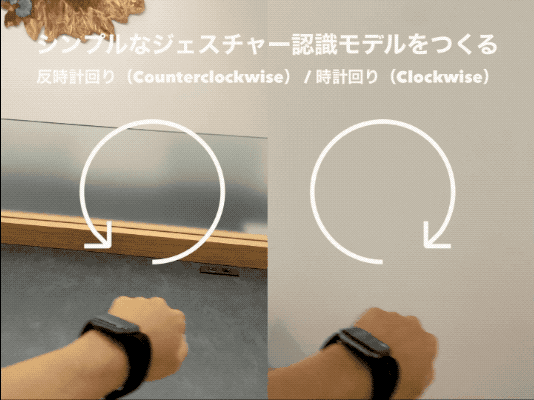

Here is the demo video: [youtu.be/I09hUyz1oG8?t=1939](https://youtu.be/I09hUyz1oG8?t=1939)

- Source code: [iOS-Experiments/ClockGestureClassification](https://github.com/shu223/iOS-Experiments/tree/master/ClockGestureClassification)
  - 学習データ収集用に作成したwatchOSアプリ、学習データ、Create MLプロジェクトは含んでいません

`watchOS`, `Activity Classification`, `Machine Learning`, `Deep Learning`, `Core ML`, `Create ML`

https://github.com/shu223/iOS-Experiments/tree/master/

### Metal on watchOS

Metal shader examples on watchOS. Though Metal framework is NOT supported on watchOS, SceneKit framework and `SCNShadable` protocol is supported and it actually works! It contains toon shading sample and grayscale sample written in MSL (Metal Shading Language).

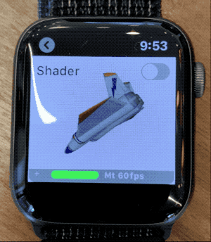

- Source code: [iOS-Experiments/watchOS-Metal](https://github.com/shu223/iOS-Experiments/tree/master/watchOS-Metal)

`watchOS`, `Metal`, `Metal Shading Language`, `shader modifier`, `SceneKit`, `MSL`, `GPU`

### AnimeSpeakerClassifier

An experimental app to classify speakers in an anime movie using `SoundAnalysis` framework. It worked well. Used Create ML to train the model. 

SoundAnalysisフレームワークを用いてアニメ動画の話者を識別できるか試した。かなりうまくいった。学習はCreate MLを使用。

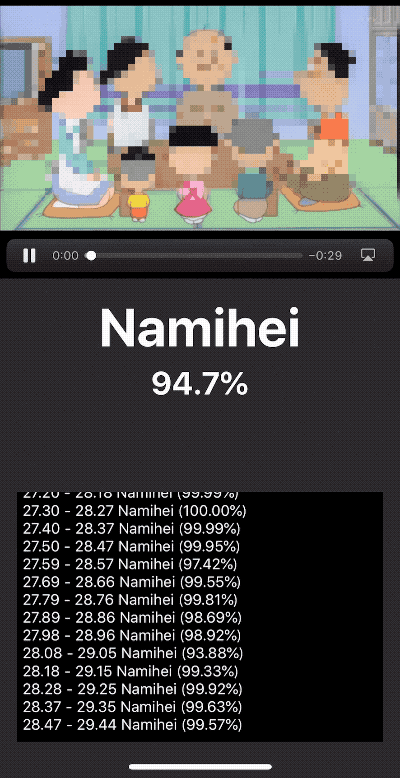

- Source code: [iOS-Experiments/AnimeSpeakerClassifier](https://github.com/shu223/iOS-Experiments/tree/master/AnimeSpeakerClassifier)
  - The Core ML model and video data have been removed from the project in consideration of copyright, so you can **NOT** build & run this project. 
  - 著作権に配慮してCore MLモデルと動画データをプロジェクトから除去しているので**ビルド不可**
  - The Create ML project file to train the model and the training data are **NOT** contained in the repo. 
  - Create MLのプロジェクトと学習用の音声データも同梱していません

`SoundAnalysis`, `Speaker Classification`, `Video Processing`, `iOS 13`

### PodcastSpeakerClassifier

An experimental app to classify speakers in a podcast audio using `SoundAnalysis` framework. It did **NOT** well. Used Create ML to train the model. 

SoundAnalysisフレームワークを用いてPodcastの話者を識別できるか試した。あまりうまくいってない。学習用の音声データが少なかったかもしれない。学習はCreate MLを使用。

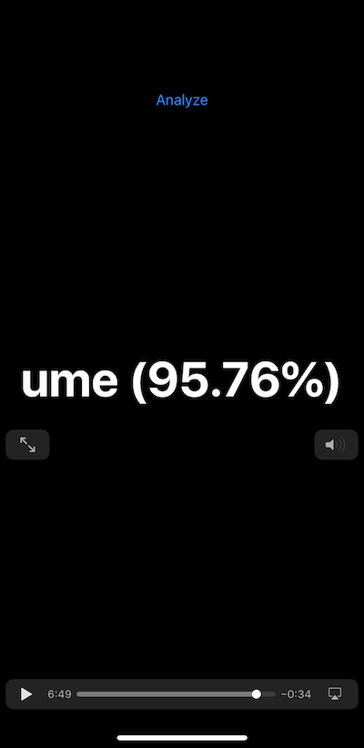

- Source code: [iOS-Experiments/PodcastSpeakerClassifier](https://github.com/shu223/iOS-Experiments/tree/master/PodcastSpeakerClassifier)
  - The Create ML project file to train the model and the training data are **NOT** contained in the repo. 
  - Create MLのプロジェクトと学習用の音声データは同梱していない。どこかにあるはずなので見つけたらアップするかも。

`SoundAnalysis`, `Sound Analysis`, `Speaker Classification`, `Audio Processing`, `iOS 13`

### Scene Reconstruction with SceneKit + ARKit

Visualizing `ARMeshGeometry` from LiDAR **without RealityKit** (with SceneKit)

- Source code: [iOS-Experiments/ARKit_SceneReconstruction](https://github.com/shu223/iOS-Experiments/tree/master/ARKit_SceneReconstruction)

`ARKit 3.5`, `LiDAR`, `Depth`, `iOS 13.4`

### Core Haptics samples

#### HapticsMaker

A sample to generate custom haptic patterns using Core Haptics framework which is added in iOS 13.

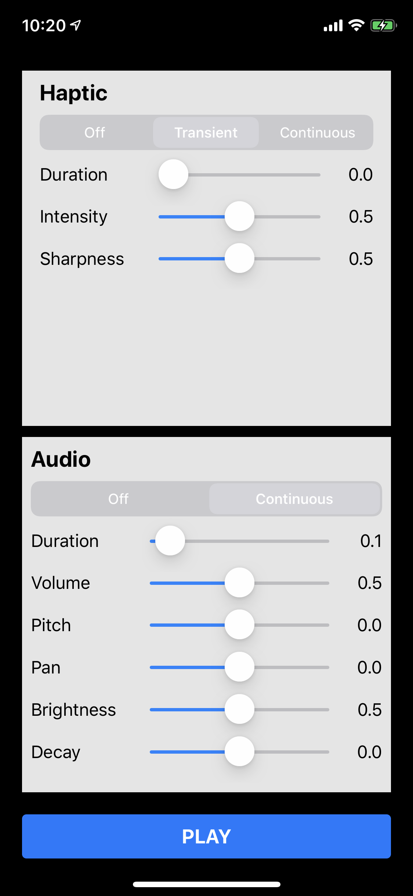

- Source code: [iOS-Experiments/CoreHaptics/HapticsMaker](https://github.com/shu223/iOS-Experiments/tree/master/CoreHaptics/HapticsMaker)

#### AHAPPlayer

A very simple example to play an AHAP file.

- Source code: [iOS-Experiments/CoreHaptics/AHAPPlayer](https://github.com/shu223/iOS-Experiments/tree/master/CoreHaptics/AHAPPlayer)

`CoreHaptics`, `Core Haptics`, `iOS 13`

### MSL from GLSL

MSL (Metal Shader Language) samples which are ported from GLSL.

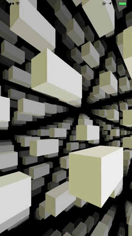

- Source code: [iOS-Experiments/MSLfromGLSL/MSLfromGLSL1](https://github.com/shu223/iOS-Experiments/tree/master/MSLfromGLSL/MSLfromGLSL1)
- Original: http://glslsandbox.com/e#36694.0

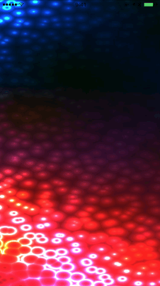

- Source code: [iOS-Experiments/MSLfromGLSL/MSLfromGLSL2](https://github.com/shu223/iOS-Experiments/tree/master/MSLfromGLSL/MSLfromGLSL2)
- Original: http://glslsandbox.com/e#36614.0

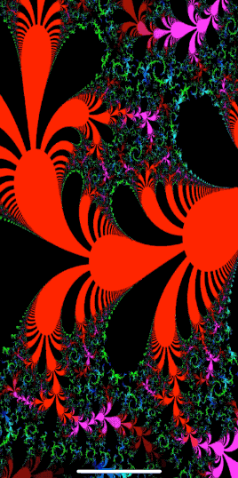

- Source code: [iOS-Experiments/MSLfromGLSL/MSLfromGLSL3](https://github.com/shu223/iOS-Experiments/tree/master/MSLfromGLSL/MSLfromGLSL3)
- Original: http://glslsandbox.com/e#36538.3

`Metal`, `Metal Shading Language`, `MSL`, `GPU`

### Rectangle Detection & Correction

A real-time camera sample to detect a rectangle using Vision (`VNDetectRectanglesRequest`, `VNRectangleObservation`) and correct it using Core Image (`CIPerspectiveCorrection`).

- Source code: [iOS-Experiments/RectangleDetection](https://github.com/shu223/iOS-Experiments/tree/master/RectangleDetection)

`Vision`, `Core Image`, `Image Processing`

### PhysicalFaceTracker

An one-day project to make a face tracking camera using iPhone and Raspberry Pi ([bleno](https://github.com/noble/bleno)).

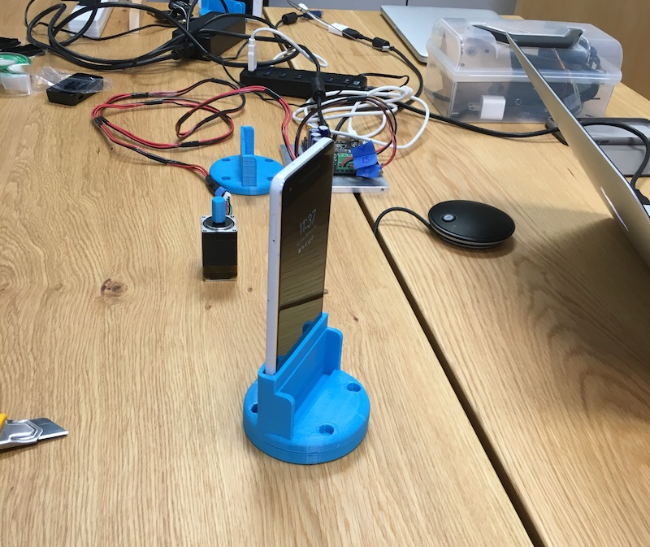

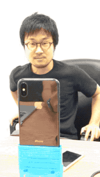

- Source code: [iOS-Experiments/PhysicalFaceTracker](https://github.com/shu223/iOS-Experiments/tree/master/PhysicalFaceTracker)
  - iOS code only. The code on Raspberry Pi and the 3D model data of the hardware are **NOT** included.

`Vision`, `CoreBluetooth`, `Image Processing`, `IoT`, `Hardware`

### Processing with Swift

#### Solar System 2D

Original(Processing): https://youtu.be/l8SiJ-RmeHU

- Source code: [iOS-Experiments/Processing/SolarSystem2D](https://github.com/shu223/iOS-Experiments/tree/master/Processing/SolarSystem2D)

`SpriteKit`, `Animation`

#### Solar System 3D

Original(Processing): https://github.com/CodingTrain/website/tree/master/CodingChallenges/CC_008_SolarSystemGenerator3D

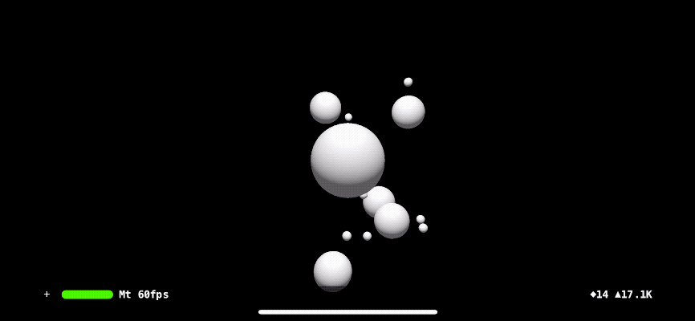

- Source code: [iOS-Experiments/Processing/SolarSystem3D](https://github.com/shu223/iOS-Experiments/tree/master/Processing/SolarSystem3D)

`SceneKit`, `Animation`, `3D`

### ZundokoBLE

- https://twitter.com/shu223/status/715946579585314820
- https://qiita.com/shu223/items/2c7b2e1ed058a1e3b33f

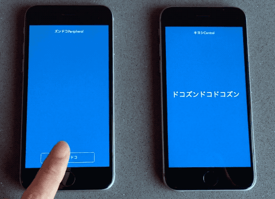

- Source code: [iOS-Experiments/ZundokoBLE](https://github.com/shu223/iOS-Experiments/tree/master/ZundokoBLE)
  - It can **NOT** be built with the latest Xcode because written in Swift 3.x.

`CoreBluetooth`, `Core Bluetooth`, `BLE`
